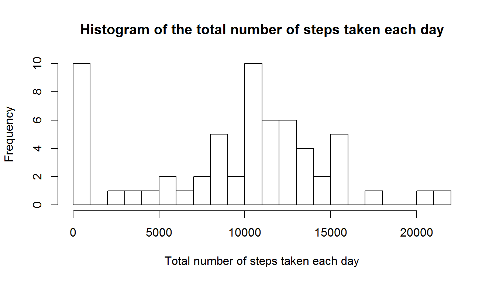
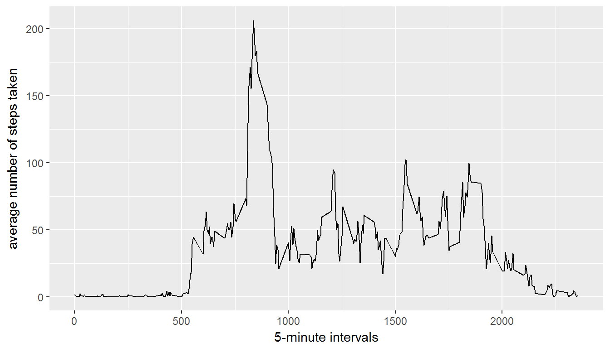
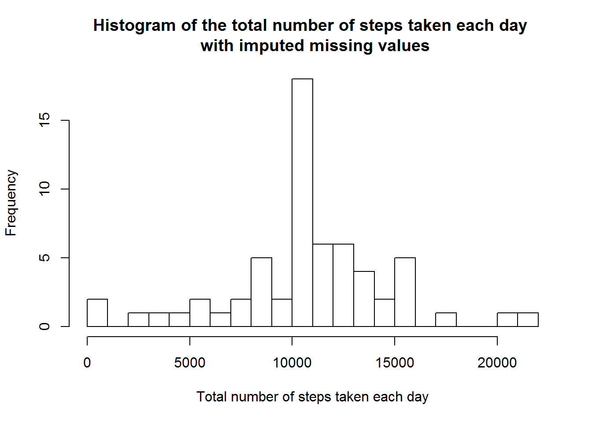
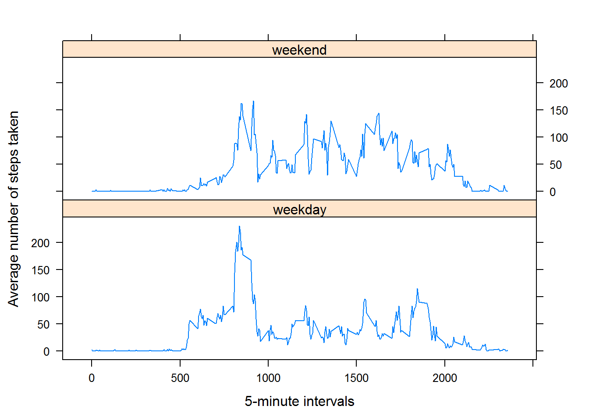

## Loading and preprocessing the data  
Reading the data:

```r
download.file("https://d396qusza40orc.cloudfront.net/repdata%2Fdata%2Factivity.zip", 
              destfile = "activity.zip")
activity <- read.csv(unz("activity.zip", "activity.csv"))
```
Convert **date** variable to **Date** format:

```r
activity$date <- as.Date(activity$date, format = "%Y-%m-%d")
```


## What is mean total number of steps taken per day?  

**1. Make a histogram of the total number of steps taken each day:**


```r
totalsteps <- with(activity, tapply(steps, date, sum, na.rm = TRUE))

hist(totalsteps, breaks = 30,
     xlab = "Total number of steps taken each day",
     main = "Histogram of the total number of steps taken each day")
```



**2. Calculate and report the mean and median total number of steps taken per day:**

```r
mean <- mean(totalsteps)
median <- median(totalsteps)
```
The **mean** of total number of steps taken per day is **9354**  
and the **median** is **10395**.        

## What is the average daily activity pattern?  
**1. Make a time series plot (i.e. type = "l") of the 5-minute interval (x-axis) and the average number of steps taken, averaged across all days (y-axis)**

```r
averages <- aggregate(x = list(steps=activity$steps),
                       by = list(interval=activity$interval),
                       FUN = mean, na.rm = TRUE)

library(ggplot2)
ggplot(data = averages, aes(x = interval, y = steps)) + 
        geom_line() + 
        xlab("5-minute intervals") +
        ylab ("average number of steps taken")
```



**2. Which 5-minute interval, on average across all the days in the dataset, contains the maximum number of steps?**

```r
maxsteps_interval <- averages[which.max(averages$steps), 1]
maxsteps_interval
```

```
## [1] 835
```

## Imputing missing values
Note that there are a number of days/intervals where there are missing values (coded as NA). The presence of missing days may introduce bias into some calculations or summaries of the data. 

**1. Calculate and report the total number of missing values in the dataset (i.e. the total number of rows with NAs)**

```r
sum(is.na(activity$steps))
```

```
## [1] 2304
```

**2. Devise a strategy for filling in all of the missing values in the dataset. The strategy does not need to be sophisticated. For example, you could use the mean/median for that day, or the mean for that 5-minute interval, etc.**

Let's choose the mean for the particular 5-minute interval for filling missing values.

Create a function that will impute the missing data with the mean value of its 5-minute interval:

```r
impute <- function(steps, interval) {
        imputed_value <- NA
        if (is.na(steps)) {
                imputed_value <- averages[averages$interval == interval, "steps"]
        }
        else {
                imputed_value <- c(steps)
        }
        imputed_value
}
```

**3. Create a new dataset that is equal to the original dataset but with the missing data filled in.**

```r
activity_filled <- activity
activity_filled$steps <- mapply(impute, activity_filled$steps, activity_filled$interval)
```

**4. Make a histogram of the total number of steps taken each day and Calculate and report the mean and median total number of steps taken per day. Do these values differ from the estimates from the first part of the assignment? What is the impact of imputing missing data on the estimates of the total daily number of steps?**

Making the histogram:

```r
totalsteps_filled <- with(activity_filled, tapply(steps, date, sum, na.rm = TRUE))
hist(totalsteps_filled, breaks = 30,
     xlab = "Total number of steps taken each day",
     main = "Histogram of the total number of steps taken each day \n with imputed missing values")
```



Calculating mean and median:

```r
mean_filled <- mean(totalsteps_filled)
median_filled <- median(totalsteps_filled)
options(scipen=2) # prevent scientific notation
```
The **mean** of total number of steps taken per day is **10766**  
and the **median** is **10766**.

Compare previous mean and median with new ones:  
Means: **9354** and **10766**  
Medians: **10395 and 10766**  
**Imputing missing values increases mean and median of steps taken per day.**  

## Are there differences in activity patterns between weekdays and weekends?

**1. Create a new factor variable in the dataset with two levels -- "weekday" and "weekend" indicating whether a given date is a weekday or weekend day (Use the dataset with the filled-in missing values for this part).**

Create a function which can distinguish between weekday or weekend:

```r
weekday_or_weekend <- function(date) {
        day <- weekdays(date)
        if (day %in% c("Monday", "Tuesday", "Wednesday", "Thursday", "Friday")) 
                return("weekday") 
        else 
                return("weekend")
}
```

Create a new factor variable indicating whether a given date is a weekday or weekend day:

```r
activity_filled$daytype <- sapply(activity_filled$date, weekday_or_weekend)
```

**2. Make a panel plot containing a time series plot (i.e. type = "l") of the 5-minute interval (x-axis) and the average number of steps taken, averaged across all weekday days or weekend days (y-axis).**

Calculate average number of steps taken on weekdays and weekends:

```r
averages_by_type <- aggregate(activity_filled$steps,
                              by=list(activity_filled$daytype,
                                      activity_filled$interval),
                              mean)
names(averages_by_type) <- c("daytype", "interval", "steps")
```
Build the lattice plot:

```r
library(lattice)
xyplot(steps ~ interval | daytype, averages_by_type, 
       type="l", 
       lwd=1, 
       xlab="5-minute intervals", 
       ylab="Average number of steps taken", 
       layout=c(1,2))
```


